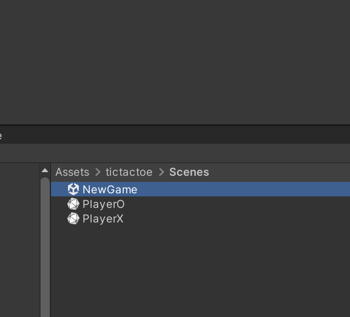
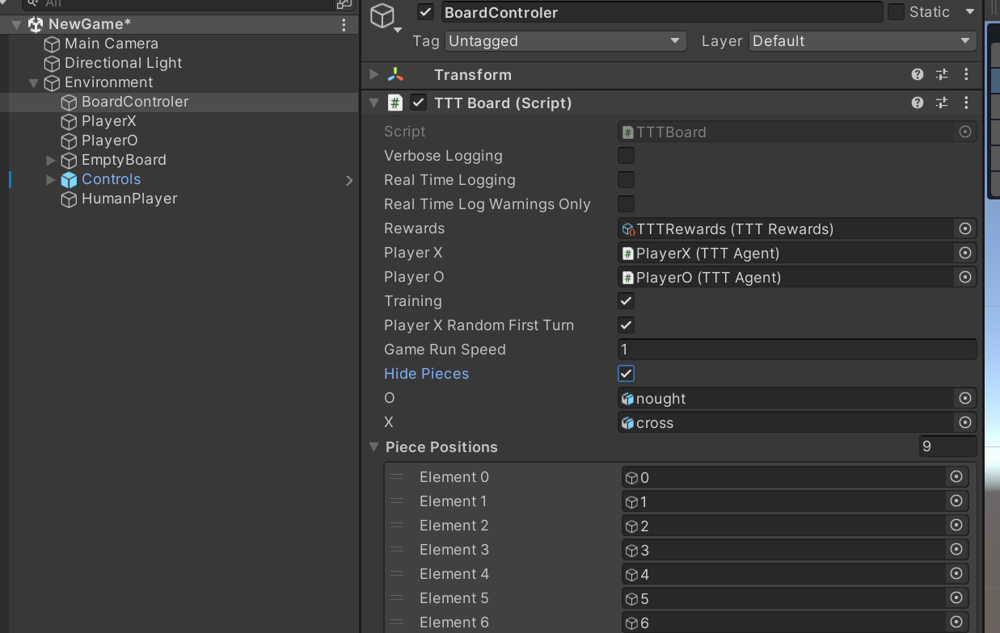
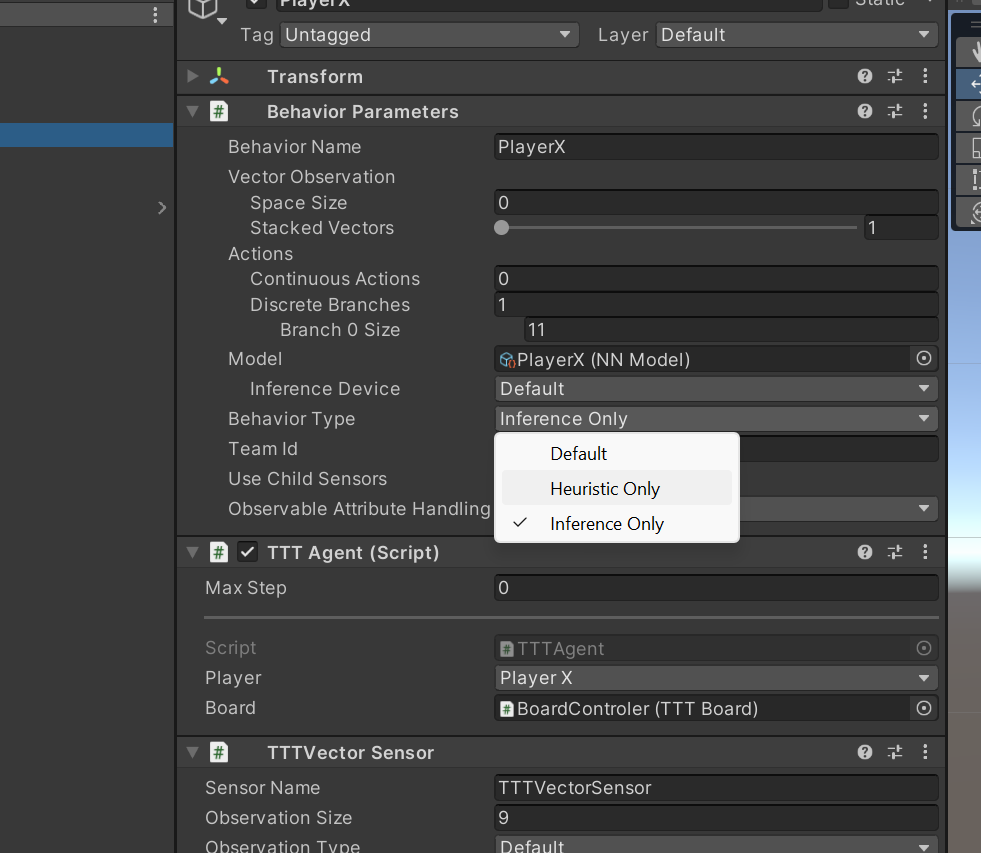
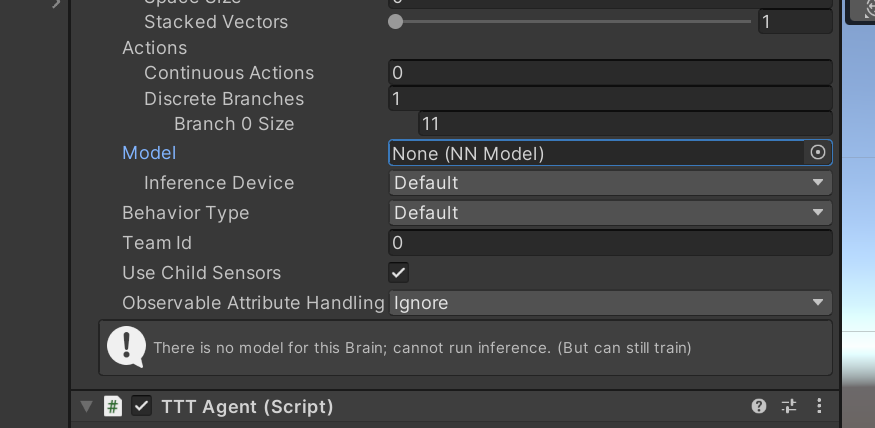
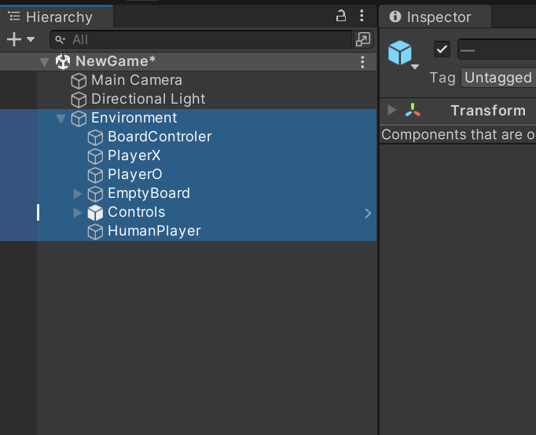

# Setup Training
Just high level guid for where everything is, this is not a training course, making the assumption you have already run some of the Unity example projects and have a feel for how it's set up.

There is just one scene in the project called NewGame where you can test play the agent and set it up for training

If you open that, theres an empty called BoardController where you can set it to training mode, all this does is make sure it auto starts and loops.  Suggest check hide pieces as well as no need to keep creating and destroying them during training.

You can see what it does by leaving the pieces showing and running the game it will loop through either making random moves or using a brain if you have one in an agent.

Next setup the agents, I suggest training one agent at a time, see video / notes as to why.  You can either train against an existing brain or heuristics, heuristics will just keep firing random moves at the opponent.

for the Agent you want to train make sure there is no grain loaded and select default.
for the agent you want to train against either select heuristics for random or load a brain and change it to inference only.

to train inside of unity you can either just run ml-agents with no environment and hit play and it will start training one agent.
or duplicate the environment and children a bunch of times and it will use them all.
something like `mlagents-learn baseline.playerX.yaml --run-id=baseline-playerX_Round1 --seed=10` will work.  you can look in the [MLAgentsConfig](../MLAgentsConfig/) folder for some example config files.

if you want to run it headless just build and then something like `mlagents-learn baseline.playerX.yaml --run-id=baseline-playerX_Round1 --seed=10  --env=D:\TicTacToe\Build --num-envs=10 --no-graphics --time-scale=20` you do not have to specify the exe just the path to where you built it.

running headless logs for all the environments get written to `results\run-id\run_logs` you can look at those to see if unity is writing out any errors, it captures what would come out of Debug.Log etc so it's quite helpful.  By default the projects wont log unless there is a warning at which point it will dump all the logs for the episode up to when the error happened.  see code for more details.

