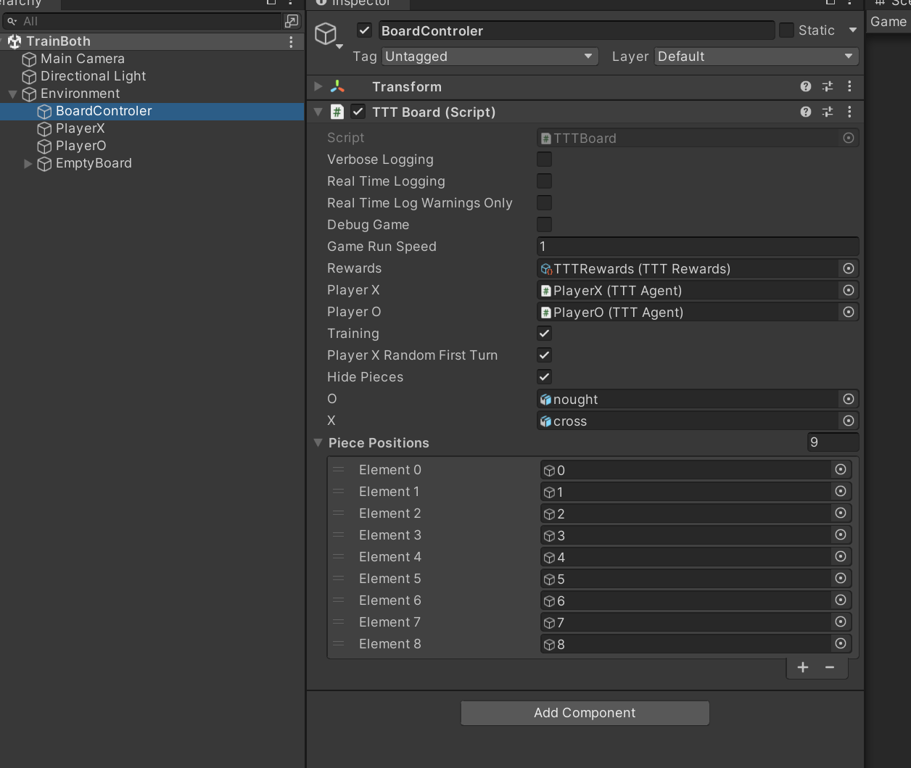

# Setup Training
Just high level guid for where everything is, this is not a training course, making the assumption you have already run some of the Unity example projects and have a feel for how it's set up.

There is just one scene in the project called TrainBoth it's set up just for training so all the pieces are hidden.

This is setup as below You can turn off Player X random first move if you like, I have it one as it gives a better spread of training for Player O to train against but what I have done is said for 40% of the time pick random for 60% of the time pick the one you think is optimum.

## Headless

if you want to run it headless just build and then something like `mlagents-learn poca-both-agents-128.yaml --seed=10   --run-id=poca-both-agents-128  --env=D:\TicTacToe\Build --num-envs=10 --no-graphics` you do not have to specify the exe just the path to where you built it.

running headless logs for all the environments get written to `results\run-id\run_logs` you can look at those to see if unity is writing out any errors, it captures what would come out of Debug.Log etc so it's quite helpful.  By default the projects wont log unless there is a warning at which point it will dump all the logs for the episode up to when the error happened.  see code for more details.

When running self training you will see an error logged every time there is a player swap I've reported it as a bug it's where academy resets to 0 on the change and it causes a 0 to get set as an action.

To work around this I have 0 masked all the tme so if I see it I just reset the training for that episode and it does not impact learning.

theres a simple batch file in [MLAgentsConfig](../MLAgentsConfig/) you can use as well.

## In Unity

If yo want to run it in unity just duplicate the environment game object and children a few times

`mlagents-learn poca-both-agents-128.yaml --seed=10   --run-id=poca-both-agents-128`